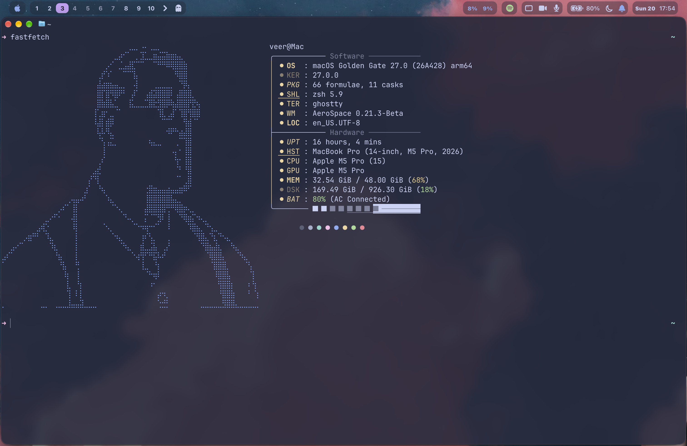

# macOS dotfiles

Catppuccin SketchyBar islands, ten AeroSpace workspaces, and a small Fastfetch setup.



## Install

- Install Apple's command-line tools and [Homebrew](https://brew.sh):

  ```sh
  xcode-select --install
  /bin/bash -c "$(curl -fsSL https://raw.githubusercontent.com/Homebrew/install/HEAD/install.sh)"
  ```

- Install AeroSpace, SketchyBar, Fastfetch, and the fonts used by the bar:

  ```sh
  brew tap FelixKratz/formulae
  brew install sketchybar fastfetch
  brew install --cask nikitabobko/tap/aerospace ghostty font-sf-pro sf-symbols
  mkdir -p "$HOME/Library/Fonts"
  curl -fsSL https://github.com/kvndrsslr/sketchybar-app-font/releases/latest/download/sketchybar-app-font.ttf \
    -o "$HOME/Library/Fonts/sketchybar-app-font.ttf"
  ```

- Clone and link the configs. Move any existing folders out of `~/.config` first.

  ```sh
  git clone https://github.com/viraj-s15/.dotfiles-macos.git "$HOME/.dotfiles-macos"
  mkdir -p "$HOME/.config"
  ln -s "$HOME/.dotfiles-macos/aerospace" "$HOME/.config/aerospace"
  ln -s "$HOME/.dotfiles-macos/sketchybar" "$HOME/.config/sketchybar"
  ln -s "$HOME/.dotfiles-macos/fastfetch" "$HOME/.config/fastfetch"
  ln -s "$HOME/.dotfiles-macos/ghostty" "$HOME/.config/ghostty"
  ```

- Install the small helper used by the battery power-mode button:

  ```sh
  sudo mkdir -p /usr/local/libexec /etc/sudoers.d
  sudo install -o root -g wheel -m 755 "$HOME/.config/sketchybar/helper/sketchybar-power-mode" /usr/local/libexec/sketchybar-power-mode
  sed "s/^veer /$USER /" "$HOME/.config/sketchybar/helper/sketchybar-power-mode.sudoers" | sudo tee /etc/sudoers.d/sketchybar-power-mode >/dev/null
  sudo chmod 440 /etc/sudoers.d/sketchybar-power-mode && sudo visudo -cf /etc/sudoers.d/sketchybar-power-mode
  ```

- Start both apps:

  ```sh
  brew services start sketchybar
  open -a AeroSpace
  ```

## macOS settings

- Grant **Accessibility** access to AeroSpace and SketchyBar in **System Settings → Privacy & Security → Accessibility**.
- Hide the stock menu bar in **System Settings → Control Center → Automatically hide and show the menu bar → Always**.
- Keep **Displays have separate Spaces** enabled in **System Settings → Desktop & Dock**.
