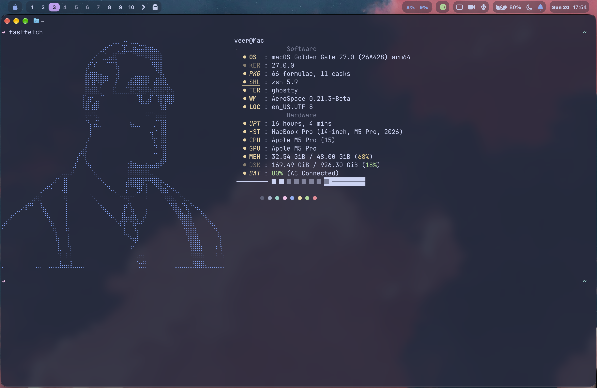

# macOS dotfiles

Catppuccin SketchyBar islands, ten AeroSpace workspaces, a small Fastfetch setup, a Starship prompt, and Neovim with the Oxocarbon theme.



## Install

- Clone the repo and run the installer:

  ```sh
  git clone https://github.com/viraj-s15/.dotfiles-macos.git "$HOME/.dotfiles-macos"
  cd "$HOME/.dotfiles-macos"
  ./install.sh
  ```

- Existing config folders and files are moved to timestamped backups before the new symlinks are created.
- Symlinks are managed by `link.sh`. `install.sh` sets `core.hooksPath` to `.githooks`, so `link.sh` reruns after every pull, checkout, and rebase. It relinks moved files, removes broken links into this repo, and reloads AeroSpace. Add new configs to `CONFIGS` in `link.sh`.
- Rerun the script after Apple Command Line Tools finish installing if prompted.
- Starship is installed and `~/.config/starship.toml` is linked; initialize the prompt in your shell (for zsh: `eval "$(starship init zsh)"` in `~/.zshrc`).
- Neovim is installed via Homebrew along with `ripgrep` and `fd`, and `~/.config/nvim` is linked to this repo's `nvim/` directory. On first launch, LazyVim downloads its plugins; the lockfile pins their versions.
- Both Oxocarbon and Catppuccin are installed. Oxocarbon is the default; use `:colorscheme catppuccin` in Neovim to switch for the current session (or change `colorscheme` in `nvim/lua/plugins/colorscheme.lua` to make it the default).
- C and C++ files use the Apple Command Line Tools `clangd` for language-server diagnostics, navigation, and completion through LazyVim's built-in Blink completion. Open a C++ project with `nvim path/to/file.cpp`; for accurate build flags, provide a `compile_commands.json` or `compile_flags.txt` in the project.
- Three-finger horizontal swipes cycle through all ten AeroSpace workspaces (including empty ones); swiping left advances, swiping right goes back, and the ends wrap around.
- The installer disables macOS's three-finger horizontal Space swipe (four-finger gestures are unchanged). Grant **Accessibility** access to **AerospaceSwipe** in **System Settings → Privacy & Security → Accessibility** when prompted. If macOS still switches native Spaces, check **Swipe between full-screen applications** in **System Settings → Trackpad → More Gestures**.

## macOS settings

- Grant **Accessibility** access to AeroSpace and SketchyBar in **System Settings → Privacy & Security → Accessibility**.
- Hide the stock menu bar in **System Settings → Control Center → Automatically hide and show the menu bar → Always**.
- Keep **Displays have separate Spaces** enabled in **System Settings → Desktop & Dock**.
